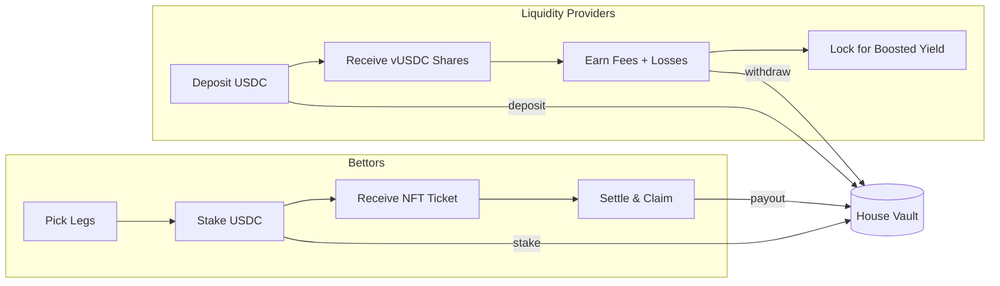
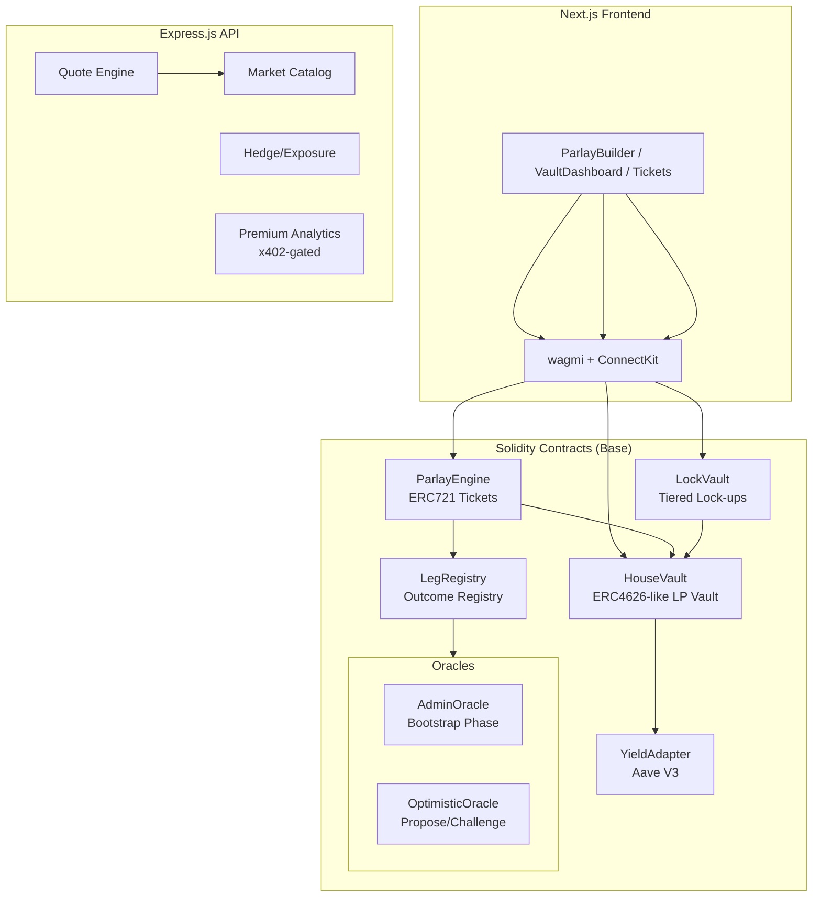
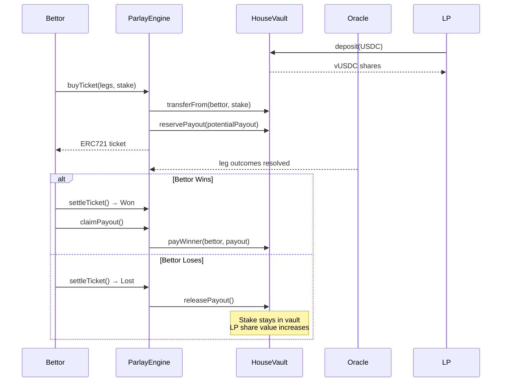
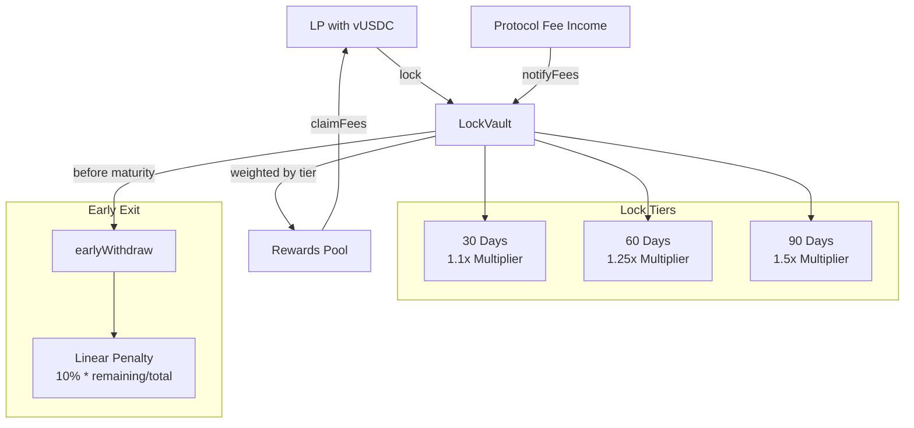
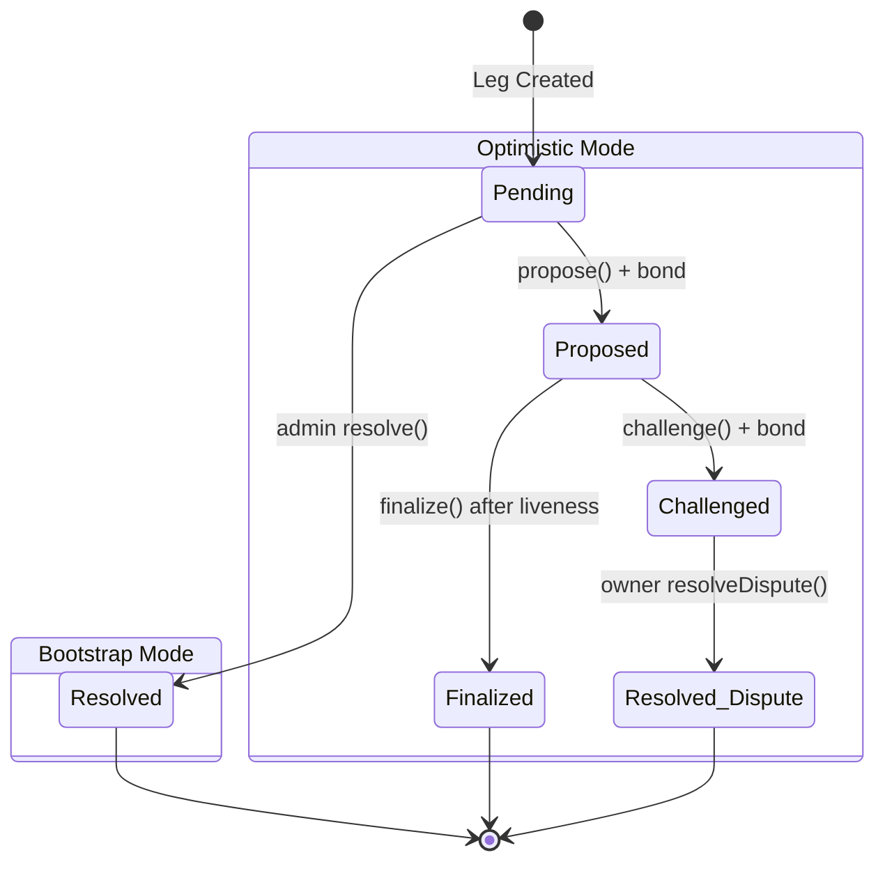

# ParlayCity

**On-chain parlay betting protocol on Base.**

Combine multiple prediction outcomes into high-multiplier parlay tickets, backed by a permissionless LP vault. Built at ETHDenver 2026.

---

## How It Works

Users pick 2-5 binary outcomes (legs), stake USDC, and receive an ERC721 parlay ticket with a combined multiplier. LPs deposit USDC into the House Vault to underwrite bets and earn from fees + losing stakes. The protocol is fully on-chain with permissionless settlement.



---

## Architecture



---

## Fund Flow



---

## Lock Vault & Fee Distribution



---

## Oracle System



The settlement mode is set at ticket purchase time based on `bootstrapEndsAt`:
- **Before**: Admin oracle (fast resolution for launch)
- **After**: Optimistic oracle (propose/challenge with USDC bonds)

---

## Project Structure

```
parlaycity/
├── apps/web/                    # Next.js 14 frontend
│   └── src/
│       ├── app/                 # Pages: /, /vault, /tickets, /ticket/[id]
│       ├── components/          # ParlayBuilder, VaultDashboard, TicketCard
│       └── lib/                 # wagmi config, hooks, ABIs, contracts
├── packages/
│   ├── contracts/               # Foundry (Solidity)
│   │   ├── src/core/            # HouseVault, ParlayEngine, LegRegistry, LockVault
│   │   ├── src/oracle/          # AdminOracle, OptimisticOracle
│   │   ├── src/yield/           # AaveYieldAdapter, MockYieldAdapter
│   │   ├── src/libraries/       # ParlayMath
│   │   ├── script/              # Deploy.s.sol
│   │   └── test/                # Unit, fuzz, invariant, integration tests
│   ├── services/                # Express.js API (quotes, markets, exposure)
│   └── shared/                  # TypeScript math, types, schemas (mirrors Solidity)
├── Makefile                     # Dev, test, deploy commands
└── package.json                 # pnpm workspace root
```

---

## Tech Stack

| Layer | Technology |
|---|---|
| Smart Contracts | Solidity 0.8.24, Foundry, OpenZeppelin 5.x |
| Frontend | Next.js 14, React 18, TypeScript, Tailwind CSS |
| Wallet | wagmi 2, viem 2, ConnectKit |
| API | Express.js, Zod, x402 payment protocol |
| Testing | Forge (unit/fuzz/invariant), Vitest, Testing Library |
| Chain | Base (Anvil for local, Base Sepolia for testnet) |
| Workspace | pnpm 8 workspaces |

---

## Contracts

| Contract | Description |
|---|---|
| `HouseVault` | ERC4626-like LP vault. Deposits USDC, mints vUSDC shares. Manages exposure reserves, yield deployment, and LP payouts. |
| `ParlayEngine` | Core betting engine. Mints ERC721 ticket NFTs. Validates legs, computes multipliers via `ParlayMath`, reserves vault exposure, handles settlement. |
| `LegRegistry` | Admin-managed registry of betting outcomes with implied probabilities (PPM). Each leg references an oracle adapter. |
| `LockVault` | Lock vUSDC shares for 30/60/90 days. Earns boosted fee share via Synthetix-style weighted reward distribution. |
| `ParlayMath` | Pure library for multiplier, edge, and payout calculations. Mirrored in TypeScript. |
| `AdminOracleAdapter` | Owner-resolved oracle for bootstrap phase. |
| `OptimisticOracleAdapter` | Propose/challenge oracle with USDC bonds and liveness window. |
| `AaveYieldAdapter` | Routes idle vault USDC to Aave V3 on Base for supply APY. |
| `MockUSDC` | 6-decimal test ERC20 with public mint (capped at 10K per call). |

---

## Getting Started

### Prerequisites

- [Node.js](https://nodejs.org/) >= 18
- [pnpm](https://pnpm.io/) >= 8
- [Foundry](https://getfoundry.sh/) (forge, anvil, cast)

### Install

```bash
git clone https://github.com/<your-org>/parlaycity.git
cd parlaycity
pnpm install
cd packages/contracts && forge install && cd ../..
```

### Local Development

```bash
# Terminal 1: Start local chain
make chain

# Terminal 2: Deploy contracts
make deploy-local
# Copy printed addresses to apps/web/.env.local

# Terminal 3: Start frontend
make dev-web

# Terminal 4 (optional): Start API server
make dev-services
```

### Environment Variables

Create `apps/web/.env.local`:

```env
NEXT_PUBLIC_CHAIN_ID=31337
NEXT_PUBLIC_HOUSE_VAULT_ADDRESS=0x...
NEXT_PUBLIC_PARLAY_ENGINE_ADDRESS=0x...
NEXT_PUBLIC_LEG_REGISTRY_ADDRESS=0x...
NEXT_PUBLIC_USDC_ADDRESS=0x...
NEXT_PUBLIC_LOCK_VAULT_ADDRESS=0x...
NEXT_PUBLIC_WALLETCONNECT_PROJECT_ID=
```

### Wallet Setup

1. Add Foundry network to your wallet: RPC `http://127.0.0.1:8545`, Chain ID `31337`
2. Import an Anvil test account (private key from `anvil` output)
3. Mint test USDC: `cast send <USDC_ADDRESS> "mint(address,uint256)" <YOUR_WALLET> 10000000000 --rpc-url http://127.0.0.1:8545 --private-key <ANVIL_KEY>`

---

## Testing

```bash
# Solidity tests (unit + fuzz + invariant + integration)
make test-contracts

# TypeScript service tests
make test-services

# All tests
make test-all

# Full quality gate (tests + typecheck + build)
make gate

# Coverage report
make coverage
```

### Test Coverage

| Suite | Tests |
|---|---|
| `HouseVault.t.sol` | Deposit/withdraw share math, reserve/release/pay, utilization cap, yield adapter integration |
| `ParlayEngine.t.sol` | Ticket lifecycle, multiplier/fees, settlement (win/loss/void/partial void), claim |
| `LegRegistry.t.sol` | CRUD, validation, access control |
| `LockVault.t.sol` | Lock positions, tier multipliers, rewards, early withdrawal penalty |
| `AdminOracle.t.sol` | Resolve, double-resolve prevention |
| `OptimisticOracle.t.sol` | Propose, challenge, finalize, dispute resolution, bond slashing |
| `ParlayMathFuzz.t.sol` | Fuzz: no overflow for 1-5 legs, payout consistency, edge monotonicity |
| `VaultInvariant.t.sol` | Invariant: `totalReserved <= totalAssets`, share/asset consistency |
| `Integration.t.sol` | Full lifecycle: win+claim, loss, partial void, lock vault, yield |
| `quote.test.ts` | 30+ tests for shared math, parsers, schemas |
| `api.test.ts` | API integration tests (markets, quotes, exposure, x402) |

---

## Key Design Decisions

**Vault-backed exposure**: The engine never holds USDC. All stakes go directly to the vault, and exposure is reserved 1:1. This means LP share value only changes through bet outcomes, not through custody risk.

**Permissionless settlement**: Anyone can call `settleTicket()` once oracle data is available. No keeper dependency for resolution.

**Partial void handling**: If some legs in a parlay are voided, the multiplier is recalculated on surviving legs rather than voiding the entire ticket. Falls back to full void only if fewer than 2 legs remain.

**Synthetix-style fee distribution**: The LockVault uses a global accumulator (`accRewardPerWeightedShare`) weighted by lock tier multipliers. O(1) per claim, no per-user iteration.

**Shared math**: `ParlayMath.sol` and `packages/shared/src/math.ts` implement identical integer arithmetic. Off-chain quotes match on-chain execution exactly.

**Yield on idle capital**: The vault's `totalAssets()` includes capital deployed to Aave via the yield adapter. Share prices reflect accrued yield with no settlement lag. A configurable buffer (default 25%) always stays local to cover payouts.

---

## License

MIT
